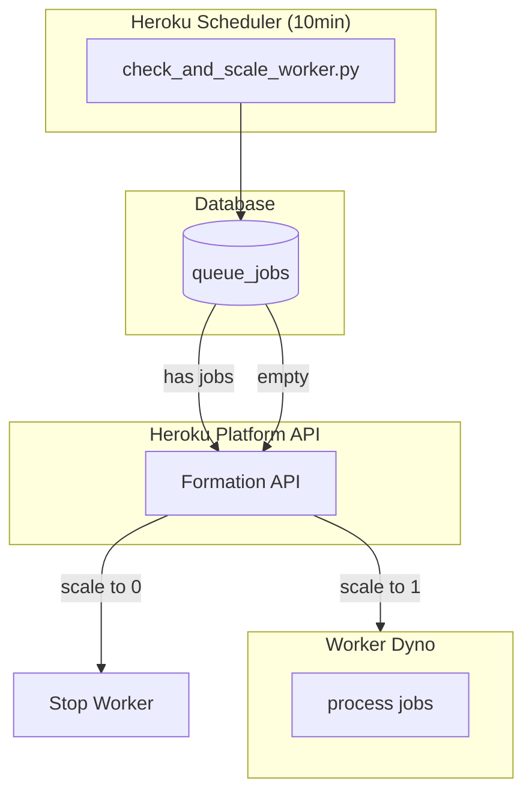
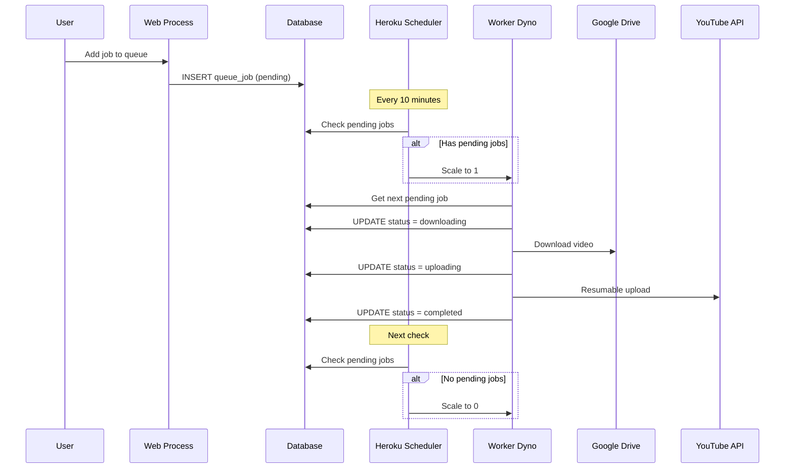

# Deployment Guide

## Heroku Deployment

### Prerequisites

1. Heroku CLI installed
2. Git repository initialized
3. Google Cloud Console project with OAuth 2.0 credentials

### Initial Setup

```bash
# Create Heroku app
heroku create your-app-name

# Add PostgreSQL
heroku addons:create heroku-postgresql:mini

# Add Scheduler (for auto-scaling)
heroku addons:create scheduler:standard
```

### Environment Variables

```bash
# Required: Google OAuth
heroku config:set GOOGLE_CLIENT_ID=your-client-id
heroku config:set GOOGLE_CLIENT_SECRET=your-client-secret
heroku config:set GOOGLE_REDIRECT_URI=https://your-app-name.herokuapp.com/auth/callback

# Required: Application
heroku config:set SECRET_KEY=$(openssl rand -hex 32)
heroku config:set AUTH_USERNAME=your-admin-username
heroku config:set AUTH_PASSWORD=your-secure-password
heroku config:set APP_ENV=production

# Required: Worker Auto-Scaling
heroku config:set HEROKU_API_KEY=your-heroku-api-key
heroku config:set HEROKU_APP_NAME=your-app-name
```

> [!TIP]
> Heroku API Key は Account Settings → API Key から取得できます。

### Deploy

```bash
git push heroku main
```

### Update Google Cloud Console

Add the following redirect URI:
```
https://your-app-name.herokuapp.com/auth/callback
```

---

## Heroku Scheduler Configuration

Heroku Schedulerで2つのタスクを設定します：

### 1. Worker Auto-Scaling (10分間隔)

```bash
python -m app.tasks.check_and_scale_worker
```

キューにジョブがあればworkerを起動、なければ停止してdyno時間を節約。

### 2. Scheduled Upload (任意の間隔)

```bash
python -m app.tasks.scheduled_upload
```

設定されたDriveフォルダをスキャンし、新しい動画をキューに追加。

---

## Architecture

### Worker Auto-Scaling Flow



### Upload Pipeline



---

## Local Development

### Using Docker Compose

```bash
# Start all services
docker-compose up

# Or start specific services
docker-compose up web worker
```

### Without Docker

```bash
# Terminal 1: Web server
uvicorn app.main:app --reload

# Terminal 2: Worker
python -m app.queue.worker
```

---

## Process Types (Procfile)

| Process | Command | Description |
|---------|---------|-------------|
| `web` | `uvicorn app.main:app` | FastAPI web server |
| `worker` | `python -m app.queue.worker` | Background job processor |

> [!NOTE]
> Worker dynoは Heroku Scheduler によって自動的にスケーリングされます。
> 手動でスケールする必要はありません。
